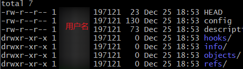

# 本地库初始化git-init

---


##### 打开Git Bash

	* 所有的git操作命令，都要在git提供的终端中执行。
	* 在任意目录下右击鼠标都可在对应路径下打开Git Bash


##### 进入创建本地库的目录

* 可以使用cd命令进入对应目录
* 在目标目录右击打开Git Bash


##### git init 初始化

* 产生.git<font color="#2980b9">隐藏目录</font>

  >.git是隐藏目录
  >
  >* 可在资源管理器中查看隐藏目录
  >* 使用Linux命令（ls -lA）查看
  >
  >cd进.git目录，ll打印目录文件，结果为：
  >
  >
  >
  >```js
  >注意：生成的 .git 目录中存放的是本地库相关文件，不要删除，也不要随意的更改。
  >```

* 过程代码:

  


##### 设置签名

* 形式

  > 用户名、Email

* 作用

  > 区分不同开发人员的身份

* 命令

  * 项目级别/仓库级别

    >仅在当前本地库范围内有效
    >
    >`git config user.name ashun`
    >
    >`git config user.email ashun@as.com`
    >
    >信息保存位置：当前项目目录下的./git/config

  * 系统用户级别

    >全局范围内有效，相对于仓库级别的设置多了`--global`
    >
    >`git config --global user.name ashun`
    >
    >`git config --global user.email ashun@as.com`
    >
    >信息保存位置：系统用户目录下的.gitconfig隐藏目录中
    >
    >使用cat .gitconfig打开。

  * 级别优先级

    >* 就近原则：二者都有时，采用项目级别的签名。

  

* **实际开发，一个全局签名就足够了。**


