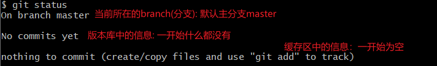
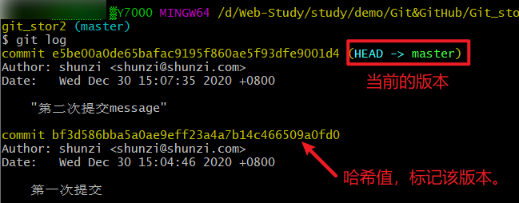
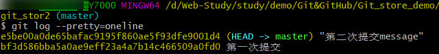
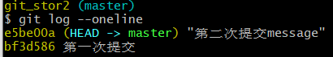
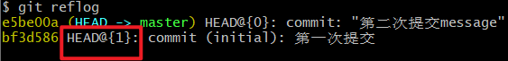
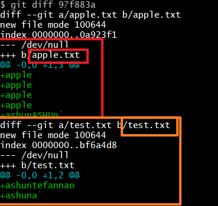

# Git命令

---

​	这些Git命令前都以`git`开头，为了简洁性下面的指令都将省略git单词。

### 设置签名

* 全局签名
  * config --global user.name ashun
  * config --global user.email  ashun@as.com
* 项目签名
  * config user.name ashun
  * config user.email  ashun@as.com


### 本地库操作

* init

  >初始化版本库，把当前所在的目录变成Git可以管理的仓库

* add

  >`git add good.txt`将文件添加到暂存区。
  >
  >添加到暂存区的文件，将被追踪（监听文件更改）

*  rm --cached

  >`git rm --cached good.txt`将文件添从缓存区撤销。

* commit

  >`git commit good.txt`将文件提交到本地版本库。
  >
  >提交文件时，会进入vim编辑器，使用vim指令输入本次提交的注释信息即可。

* commit -m "注释信息"

  >提交到本地库，并且设置注释信息
  >
  >使用该方法提交，就不用进入vim编辑器进行注释的添加了。

* commit -a

  >该指令针对于:已经被add到缓存区（被追踪）的文件.
  >
  >当对文件进行更改后，可直接通过git commit -a提交到版本库
  >
  >直接提交，跳过了添加到缓存区的过程，所以<font color="#2980b9">提交操作不能够撤回</font>
  >
  >>也可以使用老方法，先add再commit


### 查看状态

* status

  >* 当前所在的分支
  >* 版本库中是否有提交的文件
  >* 暂存区中的文件信息
  >
  >
  >
  >版本库中有提交过的文件情况下的提示。
  >
  >* 当前所在分支
  >* 缓存区信息
  >
  >


#### 版本库历史信息

* log

  >查看提交版本的历史记录。
  >
  >
  ><font color="#2980b9">HEAD指针，指向当前版本</font>,后期版本的前进与回退，就是靠移动HEAD指针来完成的。

* log --pretty=oneline

  >pretty(漂亮的)oneline(一行)
  >
  >该指令让打印结果更加的简洁，只保留标记该版本的<font color="#2980b9">hash</font>值与<font color="#2980b9">注释信息</font>，一行输出。
  >
  >
  >
  >**(该方式只能打印当前版本之前的版本信息。)**

* log --oneline

  >一行输出的最简洁形式(在`log --pretty=oneline`)基础上，缩短了hash值。
  >
  >
  >
  >**(该方式只能打印当前版本之前的版本信息。)**

* reflog

  >在(`log --oneline`)基础上，增加了<font color="#2980b9">距离当前版本移动的步数</font>`HEAD@(num)`.
  >
  >
  >
  >**(该方式能够打印所有的版本信息)**
  >
  >>由于该方式能够打印所有的版本信息，并且形式简洁，所以是**常用**的方式。


### 版本的切换

reset(重置)

* reset --hard

  >* `git reset --hard  对应哈希值`
  >
  > >该方式进行版本的切换是通过目标版本的<font color="#2980b9">哈希值</font>，进行锁定的。
  > >
  > >能够根据哈希值随意的进行版本切换。该方式较为灵活，是常用的方法。
  >
  >* `git reset --hard HEAD`
  >
  >>重置到当前最新版本.
  >>
  >>如果将某个文件删除,但是没有将删除文件的这个操作从缓存区提交到本地库,也就是没有更新本地库的最新版本,可以使用该命令重置到本地库的最新版本,也就是未删除前的版本.
  >
  >* `git reset --hard HEAD^`
  >
  > >HEAD后面连接几个`^`,就回退几个版本.（该方式只能回退版本）
  >
  >* `git reset --hard HEAD~num`
  >
  > >HEAD~n，n填写几，就回退几个版本（该方式只能回退版本）
  >
  >
  >
  >hard(硬的)，硬操作, 该操作能够使切换的版本信息同步到<font color="#2980b9">本地版本库、缓存区、工作区 三个区域</font>。
  
* reset --mixed

  >mixed(混合的),混合操作, 该操作能够使切换的版本信息只同步到<font color="#2980b9">本地版本库、缓存区</font>,不影响工作区的文件信息.

* reset --soft

  >soft(软的),软操作 .该操作能够使切换的版本信息只同步到<font color="#2980b9">本地版本库</font>,不影响缓存区、工作区,文件的信息


### 对比文件

git diff

* git diff

  * `git diff 文件名`

    >```
    >git diff good.txt
    >```
    >
    >git diff后直接跟文件名，则<font color="#2980b9">将工作区中的对应文件与缓存区对比</font>

  * `git diff 历史版本 文件名`  

    >对比历史版本的对应文件，支持版本切换的语法，可以根据 hash、^、~进行历史版本的比较。
    >
    >该语法是将工作区中的对应文件与目标历史版本文件做比较

  * `git diff/ git diff 历史版本`

    >如果diff后面没有指定的文件名，则对比所有的文件。
    >
    >

