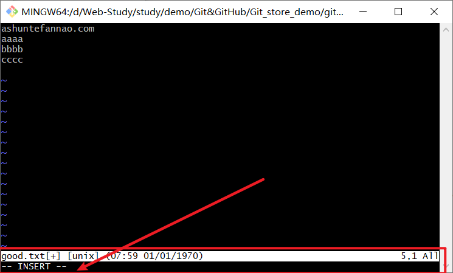
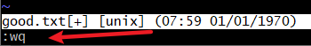

# Linux常用命令

----

#### ll

>打印当前目录下的所有目录、文件。

#### ls -lA

>打印当前目录下的隐藏目录、文件

#### cat

>进入当前项目目录中的某个文件、目录。

#### cd ~

>进入系统用户目录

### 文件操作

#### mkdir

#### rmdir

#### rm

>删除目标文件.

#### Ctrl+l

> 清空终端窗口屏幕

#### pwd

> 查看当前所在目录的path

#### vim

>`vim good.txt` 创建、进入文件，并进入vim编辑器进行编辑。
>
>若输入的文件名存在，则进入文件。
>
>若输入的文件名不存在，则创建并进入文件。

#### exit

>退出窗口

## Vim编辑器

#### i

>对文件进行编辑，按Esc可退出编辑模式。
>
>提示栏信息:INSERT(插入)

#### :wq

>退出并保存刚刚编辑的内容（先退出编辑模式，再输入:wq）
>
>

#### :set nu

>set nu（显示行号）。