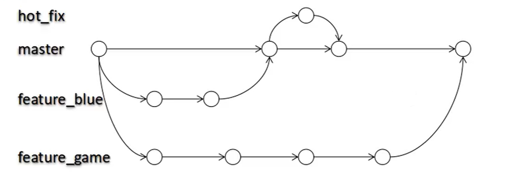

# Git_branch

---

## 什么是分支？

​	在Git中，所管理的项目版本可以通过多个分支进行迭代，这些分支是相互平行的，各个分支之间也可以进行合并。

>
>
>实际开发中，经常创建的分支。
>
>* hot_fix（热修改）: 一般是用来解决master出现的bug而创建的分支。
>* master（主人）：版本库默认的分支，主分支。
>* feature_xxx (特征):实现项目中某些功能的分支。

​	在版本库初始化时，只有一个默认分支master即主分支。我们也可以创建其他的branch进行不同功能的迭代，当某一个branch的功能迭代完毕后，也可以将该分支的内容合并到master上，这样各个开发者都有自身的分支，并且可以在自己的分支上进行增删改，各个分支之间互不影响，结构清晰，开发高效。

​	

## 分支的好处

* 多分支共同推进开发，提高开发效率

  >可以将管理的项目，根据不同的功能分为多个分支进行开发。每个小组负责一个模块，实现多个小组之间并行开发。

* 隔离性好

  >各个分支互不影响，项目结构清晰，如果某个分支开发失败，只需要将该分支删除，重新进行开发即可。