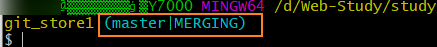

# Git的分支操作

---

### 创建分支

branch [分支名称]

>`git branch branchName`
>
>创建一个名称为branchName 的分支，并且自动将master分支中的内容clone到新创建的分支上。

### 查看分支

branch -v

>打印本地版本库的所有分支。

### 切换分支

checkout [分支名称]

>`git checkout branchName`
>
>切换到名称为branchName的分支.

### 合并分支

merge [分支名称]

>`git merge branchName`将目标branch合并到当前所在的分支。
>
>1. 进入被合并的分支
>2. 合并目标分支
>
>例如：将A合并到B，就要先进入B，然后执行`git merge A` 进行合并。

### 删除分支

branch -d [分支名称]

>`git branch -d branchName`
>
>删除目标分支。

### 解决冲突

#### 产生冲突的原因：

​	如果要将A、B两个分支进行合并，但是在合并前，对A、B两个分支中的同一个文件的同一个地方都做了更改，那么Git将不知道遵循谁的更改来进行合并，这时候就需要开发者手动进行合并。

> ​	当两个分支对同一个文件的同一个地方都做了操作，那么在进行合并的时候，git就会给出相应的提示
>
> 
>
> ​	并且在之后的操作中，git提示的所在分支名称后面会加上`|MERGING`字样，提示需要手动的合并。
>
> 
>
> 

#### 手动合并过程

* 进入产生冲突的文件

* 手动进行修改，修改到满意为止

  >git为了能够让开发者分辨，不同分支的修改信息，对其自动做了标记。
  >
  >
  >
  >
  >
  >​	我们可以对文件手动进行编辑，去掉自动生成的提示部分，留下来有用的信息。

* git add

  >​	通过`git status`啥看当前分支的状态，可以发现，产生冲突的文件，变为红色字样，并且有对应的提示信息。
  >
  >
  >
  >​	所以我们要确定当前冲突文件的状态，就需要再次add到缓存区，来解决。
  >
  >

* git commit -m "message"

  >​	需要注意的是：在这里使用的`git commit -m "message"`指令，与往常不同，之前的commit提交指令，需要指定提交的文件。
  >
  >​	这里的提交，意味着提交当前的状态，来终止手动的merge操作。指令后面，不要加文件名。
  >
  >