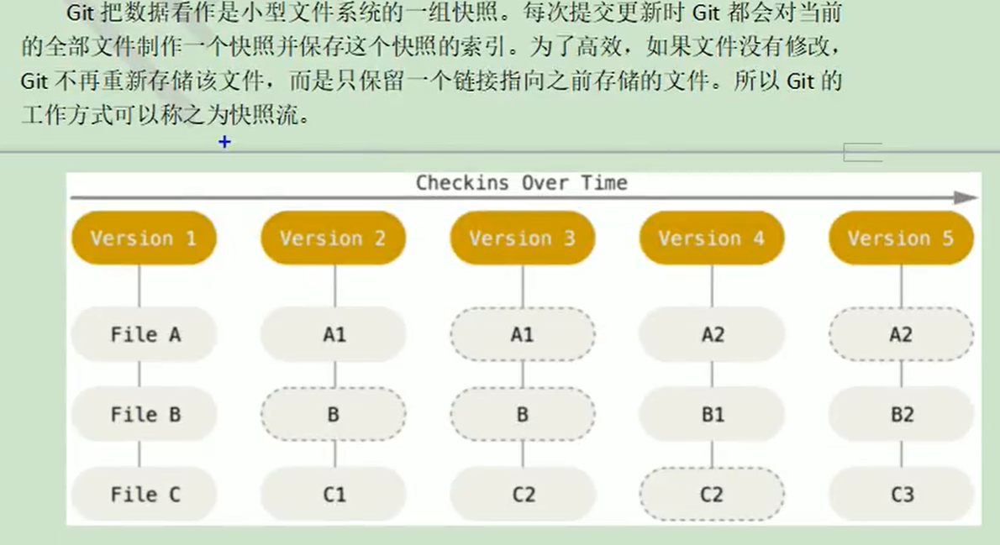
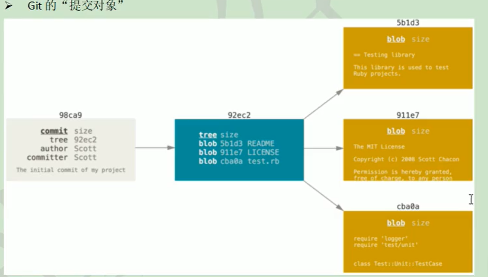
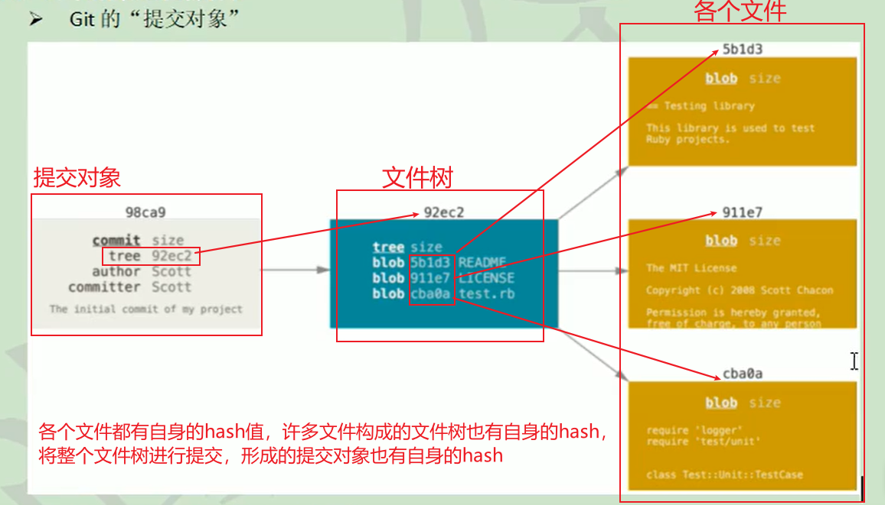
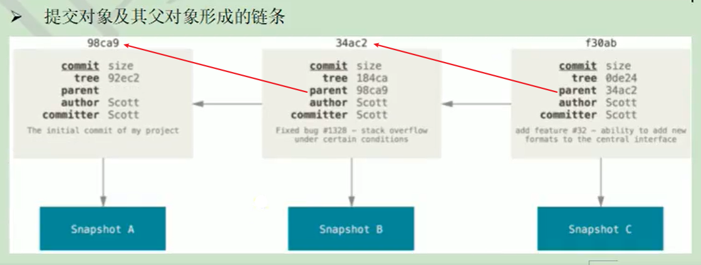
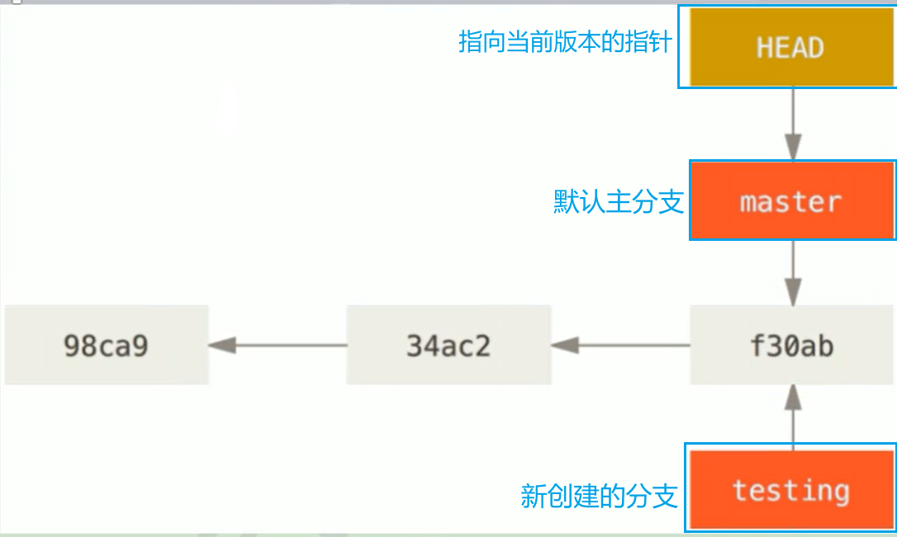
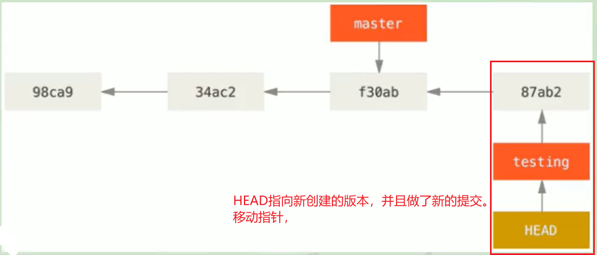
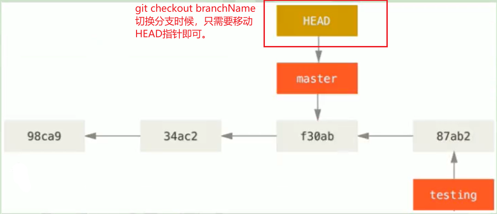
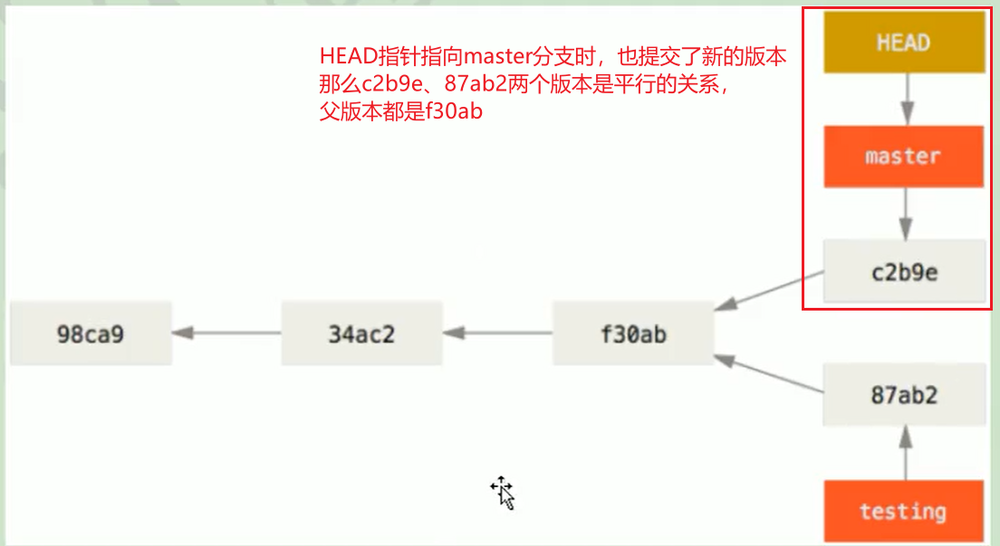

# Git版本数据的管理机制

---

### 快照流

​	快照：记录数据某一时刻的状态。

​	Git把数据看作是小型文件系统的一组快照，每次提交更新时Git都会对当前的全部文件制作一个快照并保存。为了高效，如果文件没有修改，Git将不再重新存储该文件，而只是保留一个指向之前相同文件的指针。Git的工作方式可以称之为快照流。

>

### Git文件管机制细节

---

#### 提交对象

* 各个文件具有自身的hash、各个文件形成的文件树也有自身的hash、提交整个文件树，产生的提交对象也有自身的hash值。

> 
>
> 
>
> 

#### 提交对象形成的父子链条

​	我们知道，每次向Git管理的本地版本库进行提交，都会产生记录，并且会根据提交的顺序形成父子关系链条，也就是版本迭代的过程，每个版本中都会存储父级版本的hash索引，用于构建整个版本父子链条。

> 

​	

# Git分支管理本质

---

​	Git分支管理的本质，就是创建、移动、销毁指针的过程，相对于其它版本管理工具更加的高效。

​	(SVN创建新的分支时，会将整个文件目录copy一套，操作的是整个版本库文件。Git分支管理是通过操作指针来完成的，符出的代价少，且更加简洁高效，创建新的分支时，会创建一个新的指针，指向原来的版本信息。)。

>
>
>
>
>
>
>