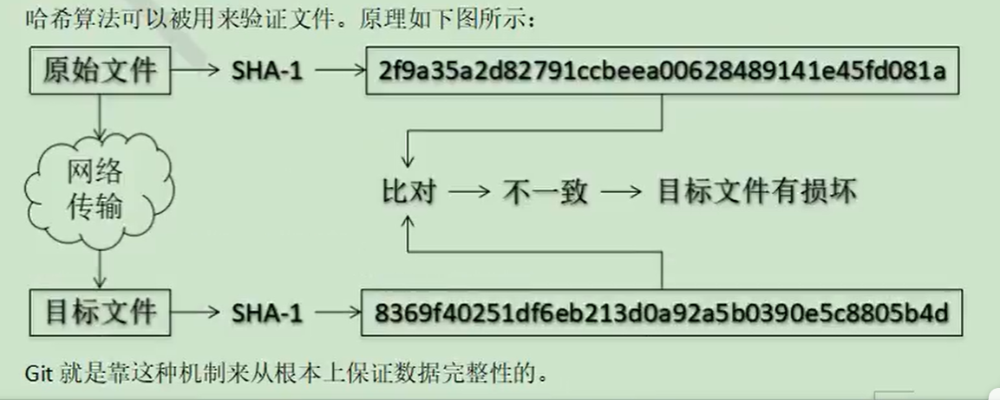

# 哈希

---

​	哈希是一个系列的算法思想，Hash算法虽然被称为算法，但实际上它更像是一种思想。Hash算法没有一个固定的公式，只要符合散列思想的算法都可以被称为是Hash算法。

### 特点

---

	1. 不管输入的数据量有多大，运用同一个hash算法，得到的结果长度固定。
 	2. hash算法确定，输入的数据确定，输出的结果能够保证不变。
 	3. 哈希算法确定，输入的数据有变化，输出的结果一定有变化，且通常变化很大。
 	4. 哈希算法不可逆

>​	hash算法确定、输入的数据确定、得到的结果是不会改变的，且如果使用的是同一个hash算法，如果输入的数据有一丝改变，得到的结果也是大不相同的。
>
>​	根据hash的特点，可以用来做数据校验。
>
>#### SHA-1
>
>​	Git底层采用的是SHA-1算法
>
>

