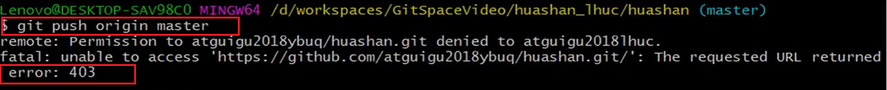

# Git远程库交互

---

## 创建远程库

​	与远程库交互，首先要创建远程库，实际工作中，远程库都由项目经理创建好。

​	这里以GitHub版本库托管平台为例。


## 在本地添加连接别名

​	由于在本地通过git指令向远程库进行交互，是通过远程库链接进行锁定的。而每次输入整个链接地址，又很费时，且容易出错，我们可以在本地创建远程库链接的别名。

### 相关Git指令

git remote(远程)

* `remote add 别名 远程库链接`

  >添加远程仓库链接别名。
  >
  >
  >
  >在GitBash窗口中粘贴信息：按Insert键即可。
  >
  >复制信息：选中内容，右键点击Copy选项。

* `remote rm 对应别名`

  >删除对应别名

* `remote rename old_alias new_alias`

  >修改对应别名.

* `remote -v`

  >打印所有远程仓库的链接别名
  >
  >

* `remote show 别名|链接`

  >显示对应远程仓库的信息。


## 推送操作

​	一开始远程库为空，项目经理需要将本地库的内容push到远程库。

### 相关Git指令

`git push 别名|链接 branchName`

>要素:
>
>* 别名|链接	(向哪里push)
>* 分支名称     (push本地库中的哪一个branch)

>过程:
>
>​	执行`git push origin branchName`指令后，会弹出GitHub的登录界面，登录远程库创建者的账号即可。
>
>
>
>​	登陆成功即可成功提交:
>
>
>
>GitHub中的远程库也会自动更新：
>
>


## 项目经理_pull_fetch

​		项目经理除了需要：创建远程库、初始化本地库并pull推送到远程库，后期还需要将远程库迭代后的版本pull到本地库。

​		pull操作，相当于fetch、merge操作的综合。【pull：拉取、fetch:拿来】

​	

### pulll

`pull 别名|url 远程库分支名`

>要素:
>
>* 向哪里拉取  `别名|url`
>* 拉取哪个分支 `远程库分支名称`
>
>pull操作，相当于是fetch+merge。即<font color="#2980b9">获取到远程库的信息后自动合并</font>。要慎重执行pull操作，因为会自动进行合并，一般微小改动才会执行pull操作，因为这样产生冲突的几率很小。当改动很大时，一般会先fetch、再手动merge。

### fetch

`fetch 别名|url 远程库分支名`

>用法和pull指令相同，但是效果不同，<font color="#2980b9">只是拿取远程库对应分支的内容，不会自动合并</font>。
>
>**进入所拿取的分支：**
>
>​	需要通过<font color="#2980b9">checkout</font>指令切换分支，只不过这里<font color="#2980b9">用法不同</font>：需要指定远程库/分支名
>
>* `checkout 别名|url/分支名`指令，切换到拿取远程库的分支，但是注意，这个分支使用`branch -v`指令并不能够打印出来。
>
>```git
>git checkout origin/master
>```
>
>>fetch、clone这些操作对于远程库来说都是只读的，不需要登录验证。

### merge

`merge 别名|url/分支名`

>​	在进行合并远程库分支时，需要使用merge指令，用法也不同，也需要指定远程库/分支
>
>```git
>git merge origin/master
>```


## 程序员操作clone、push

​	程序员可以将项目经理创建的远程库进行clone、然后进行操作，在push。

​	建立一个文件夹，用于管理程序员clone的库信息。


#### clone

相关指令:`git clone 别名/链接`

>* clone指令会将远程库的所有信息进行clone，包括存储的远程库别名等等。
>* 由于clone下来的库，就是一个初始化好的库，所以这里不用初始化，也不用设置别名。
>* 通过远程库的<font color="#2980b9">链接</font>clone即可
>
>
>
>clone完毕后，先进入clone下来的项目目录中，打印保存的别名、文件。全部信息都有。
>
>


#### push

​	之前我们已经学习过与远程库交互的过程了，如果程序员想要向远程库进行push，前提是要加入该团队。

##### 未加入团队

>进行push，会报错。
>
>

##### 加入团队

* 需要项目经理邀请程序员加入团队

  >项目经理在GitHub上向程序员账号发出邀请，
  >
  >Settings(设置)->Manage access(访问权限管理)-> Invite a collaborator(邀请合作者)
  >
  >

加入团队后，程序员即可享有push的权限，使用`git push origin branchName`命令，进行push即可。


## 协同开发解决冲突

​	协同开发过程中，肯定少不了冲突，因为多人开发，可能会操作同一个文件的同一个地方，这时，如果二者都向远程库进行进行push，那么Git将不知道按谁的更改进行合并。<font color="#2980b9">Git会让最先推送的版本成功push，而第二个人在push的时候就会失败。</font>

#### 解决	

​		后push的程序员，<font color="#2980b9">需要先</font>将远程库最新版本<font color="#2980b9">进行拉取pull</font>,由于pull会自动合并，这时Git就会提示需要手动合并，之后的解决步骤就和分支管理冲突相同：手动更改冲突文件直至满意、add、commit（不加文件名），最后再向远程库进行push即可。

>* 程序员1更改文件，进行push，push成功
>
> 
>
>* 程序员2更改相同文件的相同位置，进行push，push失败，产生冲突。
>
> 
>
>* 拉取远程库，手动合并
>
> 由于pull操作会自动merge，这时候Git会自动进入手动merge状态
>
> 
>
>* 编辑冲突文件
>
> 
>
>* git add、commit(不写文件名)
>
> 
>
> 
>
>* push
>
> 
>
> 