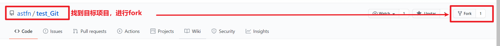

# GitHub_队外协作

---

​	GitHub和其它远程库托管平台，除了能够完成队内协作，还可以进行跨团队协作。

## 主要步骤

### 队外人员

* 在GitHub上对目标项目进行fork（分叉）
* fork后得到属于自己的远程库
* 对自己的远程库进行clone、push
* 在GitHub上Pull Request

### 队内项目经理

* 检查代码后，同意队外人员拉取的请求，合并。
* 将merge好的远程库pull到本地即可。

## 详细操作

### 队外人员

* 在GitHub上对目标项目进行fork（分叉）

  >

* fork后得到属于自己的远程库

  >* 
  >* 

* 对自己的远程库进行clone、push

* 在GitHub上Pull Request

  >* 点Pull Requests，增加新的pull request。
  >
  >  
  >
  >* 点击创建拉去请求create pull request
  >
  >  
  >
  >* 编辑请求信息，创建拉取请求
  >
  >  

### 队内项目经理

* 通过Pull Requests查看对外人员拉取的请求

  >
  >
  >可与队外拉取请求者进行交流
  >
  >
  >
  >可检查代码
  >
  >

* 检查无误后，可以与远程库进行merge

  >* 
  >
  >* 点击后，提示框会改变，需要填入本次合并的日志信息。
  >
  >  
  >
  >* 远程库代码成功合并。
  >
  >  

* 再将合并好的远程库信息pull到本地即可。