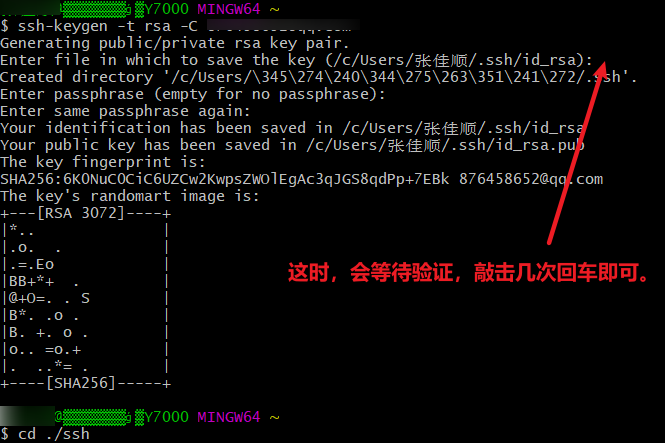
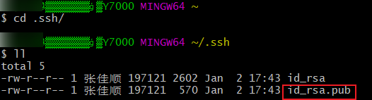
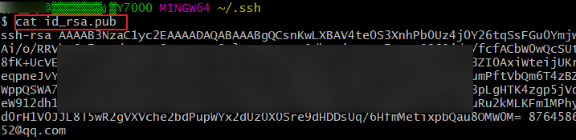
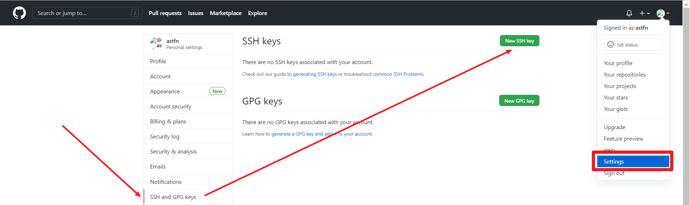
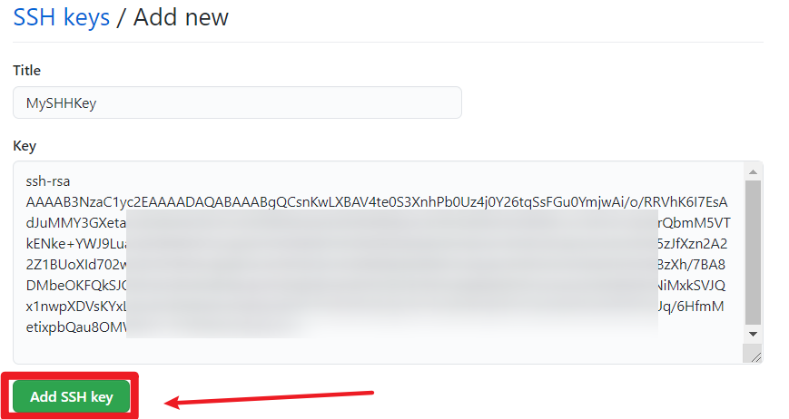
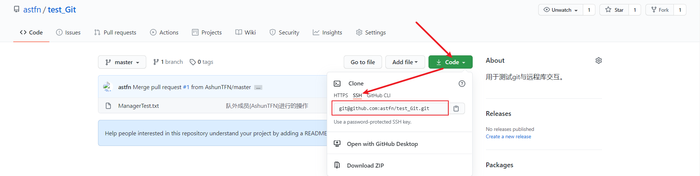
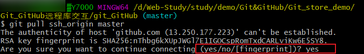

# SSH免密登录

---

​	我们知道，本地库与远程库进行交互，是通过链接来锁定远程库的。而远程库链接分为两种：

* HTTP

  >​	之前一直使用的Http链接，每次与远程库进行交互时都需要登录验证身份（除了只读操作),这显然是很麻烦的。

* SSH

  >​	我们可以使用SSH链接，在本地设置的密钥，然后在GitHub上添加上密钥即可，这样就不用每次验证身份了。
  >
  >**每台电脑上的一个user只能设置一个SSH密钥**

## SSH密钥配置

* 进入电脑当前登录用户的目录`cd ~`
* 如果之前设置过SSH密钥，需要先删除原来的`.ssh`目录
* 运行指令，生成`.ssh`目录
* 进入`.ssh`目录，查看文件列表。
* 查看`.ssh/id_rsa.pub`文件内容（密钥）
* 将密钥在GitHub上进行配置
* 在本地添加SSH链接的alias
* 之后通过`ssh别名|ssh链接`访问远程库，就不用登陆验证了。

### 详细步骤：

* 进入电脑当前登录用户的目录`cd ~`

* 如果之前设置过SSH密钥，需要先删除原来的`.ssh`目录

  >`rm -r .ssh`

* 运行指令，生成`.ssh`目录

  >`ssh-keygen -t rsa -C GitHub用户邮箱`
  >
  >执行指令后，会等待验证，敲击几次回车，让内容打印完毕即可。
  >
  >

* 进入`.ssh`目录，查看文件列表。

  >

* 查看`.ssh/id_rsa.pub`文件内容（密钥）

  >

* 将密钥在GitHub上进行配置

  >用户头像->settings->SSHand GPG keys->new SSH key
  >
  >* 
  >* 

* 在本地添加SSH链接的alias

  >* 
  >* `git remote add 别名 URL`

* 之后通过`ssh别名|ssh链接`访问远程库，就不用登陆验证了。

  >第一次交互，需要确认，之后就不用了。
  >
  >

​	

